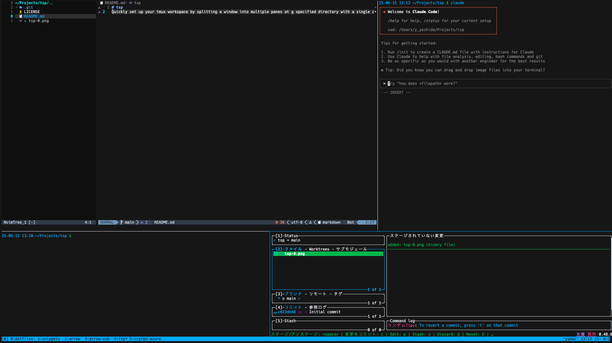

# TSPS (Tmux Split Panes)

Quickly set up your tmux workspace by splitting a window into multiple panes at a specified directory with a single command.

## Problem it solves

When working with tmux, you often want to set up the same pane layout repeatedly - multiple panes all navigated to your project directory. Manually splitting panes and navigating each one to the right directory becomes tedious, especially when opening new tmux windows frequently.



TSPS automates this repetitive setup process. Instead of manually:

1. Creating each pane
2. Navigating to your project directory in each pane with `cd /path/to/project`
3. Arranging panes to your preferred layout

You can now simply run: `tsps 4 /path/to/project` or `tsps -l dev.yaml` and get your ideal workspace instantly.

https://github.com/user-attachments/assets/1e17e188-93f1-47e2-b045-bd6a3aefd614

## Installation

### Via Cargo

```bash
cargo install tsps
```

### Via GitHub Release (macOS Apple Silicon)

```bash
# Download the latest release
curl -L https://github.com/yyossy5/tsps/releases/latest/download/tsps-aarch64-apple-darwin -o tsps

# Make it executable
chmod +x tsps

# Move to your PATH
mv tsps ~/.local/bin/
```

## Usage

### Basic Usage

```bash
# Create 4 panes, all navigated to /path/to/project
tsps 4 /path/to/project

# Create 3 panes in current directory
tsps 3 .

# Create 2 panes in home directory
tsps 2 ~
```

### Layout Files (YAML)

You can define custom layouts using YAML files for more complex workspace setups:

```bash
# Use a predefined layout file
tsps --layout examples/dev.yaml

# Or use the short form
tsps -l examples/simple.yaml
```

#### Example Layout File

See the examples directory.

## Features

### Basic Features

- Create specified number of panes in current tmux window
- All panes automatically navigate to specified directory
- Alternates between horizontal and vertical splits
- Automatically arranges panes in tiled layout
- Error handling (tmux session check, directory validation, etc.)

### Advanced Features (YAML Layouts)

- Define custom workspace layouts with YAML files
- Execute specific commands in each pane automatically
- Control pane split directions (horizontal/vertical)
- Set initial focus on specific panes
- Add descriptions and identifiers to panes
- Create reusable workspace templates

### Layout Configuration Options

#### Workspace Settings

- `name`: Layout name for identification
- `description`: Optional description of the layout
- `directory`: Base directory for all panes

#### Pane Settings

- `id`: Optional identifier for the pane
- `split`: Split direction (`horizontal` or `vertical`)
- `commands`: List of commands to execute in the pane
- `focus`: Set to `true` to focus this pane initially
- `size`: Pane size specification (percentage like "30%" or lines/columns like "10")

### Example Layout Files

The project includes several example layout files in the `examples/` directory:

- `examples/simple.yaml` - Basic 2-pane editor + terminal setup
- `examples/dev.yaml` - 4-pane development workspace

Use these as templates for your own custom layouts!

#### Size Specification Examples

```yaml
panes:
  # Main editor (no size = uses remaining space)
  - id: "editor"
    commands: ["nvim ."]

  # Sidebar taking 30% of width
  - id: "sidebar"
    split: "vertical"
    size: "30%"
    commands:
      - "ls -la"

  # Bottom pane with fixed 15 lines height
  - id: "terminal"
    split: "horizontal"
    size: "15"
    commands:
      - "htop"
```

## Update

### If installed via Cargo

```bash
cargo install tsps --force

# If you have cargo-update package
cargo install-update tsps
```

### If installed via GitHub Release

```bash
# Download the latest release
curl -L https://github.com/yyossy5/tsps/releases/latest/download/tsps-aarch64-apple-darwin -o tsps

# Make it executable
chmod +x tsps

# Replace the existing binary
mv tsps ~/.local/bin/
```

## Uninstall

### If installed via Cargo

```bash
cargo uninstall tsps
```

### If installed via GitHub Release

```bash
rm ~/.local/bin/tsps
```
